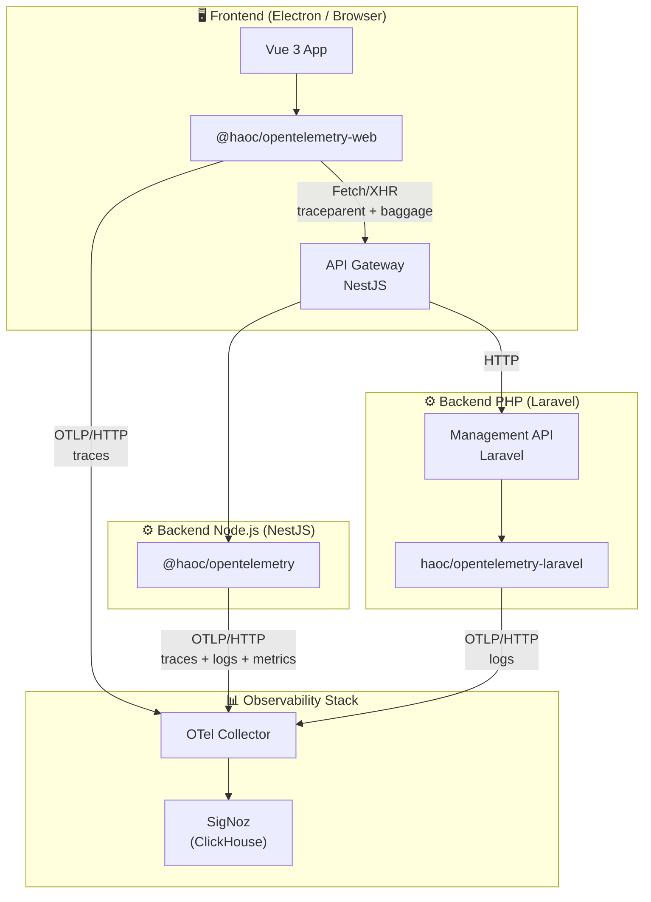
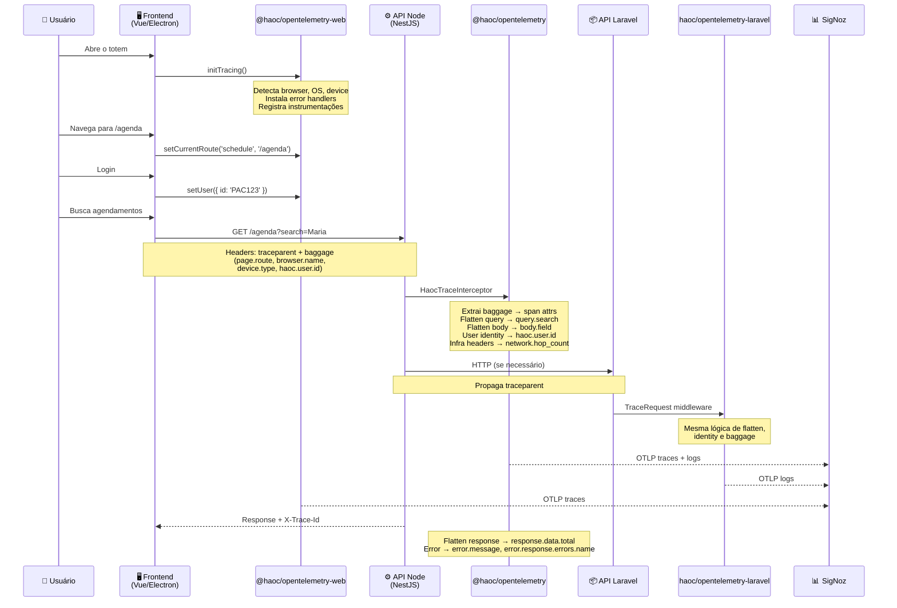
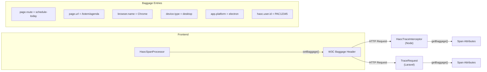
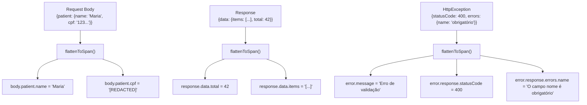

# HAOC OpenTelemetry — Arquitetura e Documentação

## Visão Geral

Monorepo de bibliotecas de observabilidade padronizadas do Hospital Alemão Oswaldo Cruz (HAOC), fornecendo **tracing distribuído**, **logs estruturados**, **detecção de browser/dispositivo**, **identidade de usuário** e **propagação de contexto** para todas as aplicações do ecossistema.

### Pacotes

| Pacote | Linguagem | Target | Versão |
|---|---|---|---|
| [`@haoc/opentelemetry`](packages/node/README.md) | TypeScript | Node.js (NestJS / Express) | 1.1.0 |
| [`@haoc/opentelemetry-web`](packages/web/README.md) | TypeScript | Web (Vue / React / Electron) | 1.0.0 |
| [`haoc/opentelemetry-laravel`](packages/laravel/README.md) | PHP | Laravel 11+ | 1.0.0 |

## Diagrama de Arquitetura



## Fluxo de Dados End-to-End



## Propagação de Contexto (W3C Baggage)



## Notação de Ponto (Flatten)

Todos os dados de request/response são achatados em notação de ponto para facilitar consultas no SigNoz:



## Identidade de Usuário

As três libs compartilham os mesmos nomes de atributo para permitir consultas consistentes no SigNoz:

| Atributo | Frontend | Node Backend | Laravel Backend |
|---|---|---|---|
| `haoc.user.id` | `setUser()` | `setUser()` + Baggage | `Auth::id()` + Baggage |
| `haoc.user.role` | `setUser()` | `setUser()` | — |
| `haoc.user.type` | `setUser()` | `setUser()` | — |

## Dados Sensíveis

Redação automática em duas camadas:

1. **Flatten** — `flattenToSpan()` / `flattenToRecord()` verificam o campo contra a lista de sensíveis antes de gravar
   - Password, senha, token, secret, access_token, refresh_token, authorization, db_password, network_password, tasy_password
   
2. **Pino Redact** (Node) — 60+ paths cobrindo patterns aninhados (`user.password`, `body.token`, etc.)

## Infraestrutura e Hops

O interceptor captura headers de proxy/load balancer para rastreamento de infraestrutura:

| Header | Atributo | Uso |
|---|---|---|
| `X-Forwarded-For` | `http.forwarded_for` | IPs na cadeia de proxies |
| `X-Real-IP` | `http.real_ip` | IP real do cliente |
| `X-Forwarded-Host` | `http.forwarded_host` | Host original |
| `X-Forwarded-Proto` | `http.forwarded_proto` | Protocolo (http/https) |
| `Via` | `http.via` | Proxies intermediários |
| (calculado) | `network.hop_count` | Quantidade de hops na cadeia |

## Estrutura do Monorepo

```
haoc-opentelemetry/
├── package.json              # Workspace root (npm workspaces)
├── Dockerfile                # Build multi-package
├── docker-compose.yml        # Build container + volumes
│
├── packages/
│   ├── node/                 # @haoc/opentelemetry
│   │   ├── src/
│   │   │   ├── index.ts              # Barrel exports (core)
│   │   │   ├── tracing/              # setupTracing(), config
│   │   │   ├── identity/             # setUser(), getUser(), constants
│   │   │   ├── logger/               # Pino config, redaction
│   │   │   ├── nestjs/               # Module, Interceptor, Bootstrap
│   │   │   │   ├── index.ts          # Barrel exports (nestjs)
│   │   │   │   ├── logger.module.ts  # HaocLoggerModule
│   │   │   │   ├── trace.interceptor.ts  # HaocTraceInterceptor
│   │   │   │   ├── bootstrap.ts      # configureHaocApp()
│   │   │   │   └── types.ts
│   │   │   ├── express/              # Middleware para Express puro
│   │   │   └── utils/                # flatten, sanitize, stringify
│   │   ├── package.json
│   │   └── README.md
│   │
│   ├── web/                  # @haoc/opentelemetry-web
│   │   ├── src/
│   │   │   ├── index.ts              # Barrel exports
│   │   │   ├── tracing.ts            # initTracing()
│   │   │   ├── processor.ts          # HaocSpanProcessor + setCurrentRoute
│   │   │   ├── identity.ts           # setUser(), getUser()
│   │   │   ├── browser.ts            # detectBrowserInfo()
│   │   │   └── errors.ts             # Error handlers + Vue handler
│   │   ├── package.json
│   │   └── README.md
│   │
│   └── laravel/              # haoc/opentelemetry-laravel
│       ├── src/
│       │   ├── HaocOpenTelemetryServiceProvider.php
│       │   ├── Middleware/TraceRequest.php
│       │   └── Logging/
│       │       ├── OtelHandler.php
│       │       └── OtelLogChannelFactory.php
│       ├── config/haoc-otel.php
│       ├── composer.json
│       └── README.md
```

## Configuração em Docker

### API NestJS

```yaml
# api/docker-compose.yml
services:
  node:
    volumes:
      - ../haoc-opentelemetry/packages/node:/var/www/node_modules/@haoc/opentelemetry
    networks:
      - signoz
```

### Frontend Vue/Electron

```yaml
# client/docker-compose.yml
services:
  node:
    volumes:
      - ../haoc-opentelemetry/packages/web:/app/node_modules/@haoc/opentelemetry-web
    networks:
      - signoz
```

### Management Laravel

```yaml
# management/docker-compose.yml
services:
  app:
    volumes:
      - ../haoc-opentelemetry/packages/laravel:/var/www/vendor/haoc/opentelemetry-laravel
    networks:
      - signoz
```

Todas as redes `signoz` devem referenciar a rede externa `signoz-shared`:

```yaml
networks:
  signoz:
    name: signoz-shared
    external: true
```

## Setup Rápido

### 1. Build das libs

```bash
cd haoc-opentelemetry
docker compose up --build -d
```

### 2. API NestJS (2 linhas)

```typescript
// main.ts
import { setupTracing } from '@haoc/opentelemetry';
setupTracing({ serviceName: 'minha-api' });
```

```typescript
// app.module.ts
@Module({ imports: [HaocLoggerModule.forRoot()] })
export class AppModule {}
```

### 3. Frontend Vue (1 chamada)

```typescript
import { initTracing } from '@haoc/opentelemetry-web';
initTracing({ serviceName: 'meu-app', otlpEndpoint: '...' });
```

### 4. Laravel (config automático)

```bash
composer require haoc/opentelemetry-laravel
# Auto-discovery registra o service provider
```

## Consultas úteis no SigNoz

### Traces de um usuário específico

```
haoc.user.id = 'PAC12345'
```

### Requests lentos (>1s)

```
http.duration_ms > 1000
```

### Erros de validação

```
error.type = 'HttpException' AND http.status_code = 400
```

### Requests de um browser/device específico

```
browser.name = 'Chrome' AND device.type = 'desktop'
```

### Fluxo completo frontend → backend

```
page.route = 'schedule-today'
```

## Licença

MIT — Hospital Alemão Oswaldo Cruz
